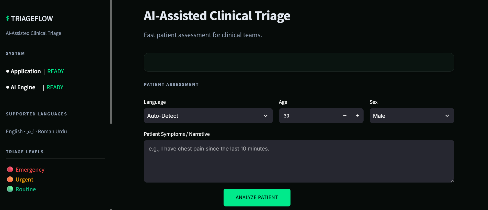
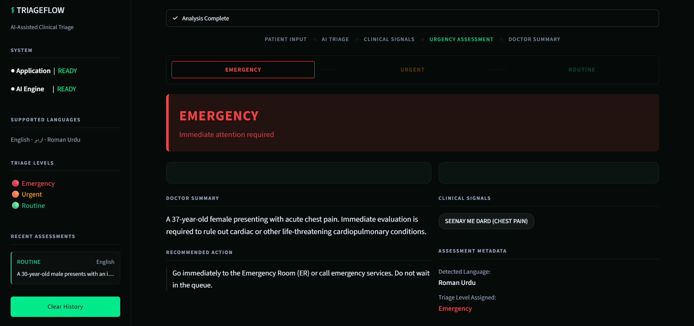

# ⚕️ TriageFlow

**AI-powered clinical triage tool that analyzes patient symptoms, identifies urgency, and provides clear summaries for healthcare teams.**

TriageFlow is an AI-assisted clinical triage application designed to help healthcare teams organize and assess patient symptom descriptions through a simple, structured workflow.

The system combines a deterministic emergency safety layer with **Google Gemini** to classify urgency, extract relevant symptoms, detect the input language, generate a concise clinical summary, and provide a recommended next step.

> **TriageFlow is designed to assist clinical workflows, not replace qualified medical professionals or make independent medical decisions.**

---

## 📋 Table of Contents

* [What Problem It Solves](#-what-problem-it-solves)
* [What TriageFlow Does](#-what-triageflow-does)
* [Why TriageFlow](#-why-triageflow)
* [Key Features](#-key-features)
* [Technologies Used](#-technologies-used)
* [Project Structure](#-project-structure)
* [Project Files and Responsibilities](#-project-files-and-responsibilities)
* [How the System Works](#-how-the-system-works)
* [System Architecture](#-system-architecture)
* [Triage Urgency Levels](#-triage-urgency-levels)
* [Safety Guardrail and Emergency Override](#-safety-guardrail-and-emergency-override)
* [Structured AI Output](#-structured-ai-output)
* [Multilingual Support](#-multilingual-support)
* [Dashboard](#-dashboard)
* [Example Assessment](#-example-assessment)
* [Technical Overview](#-technical-overview)
* [How to Run Locally](#-how-to-run-locally)
* [Environment Variables](#-environment-variables)
* [Deployment](#-deployment)
* [Key Technical Concepts](#-key-technical-concepts)
* [Design Decisions](#-design-decisions)
* [Privacy and Data Handling](#-privacy-and-data-handling)
* [Limitations](#-limitations)
* [Future Improvements](#-future-improvements)
* [Disclaimer](#-disclaimer)
* [Author](#-author)

---

## 🩺 What Problem It Solves

In a busy healthcare environment, patients often describe their symptoms in natural language rather than using structured medical forms.

A patient might write:

> "Mujhe seene mein bohat zyada dard ho raha hai aur saans lene mein mushkil ho rahi hai."

For a healthcare team, the important questions are:

* How urgent could this situation be?
* What symptoms were actually mentioned?
* What should the triage team pay attention to?
* Can the information be summarized quickly?
* Can patients communicate naturally in different languages?

Traditional forms can require patients to understand medical terminology or manually organize their symptoms.

**TriageFlow converts a natural-language patient description into a structured triage assessment.**

---

## 🤖 What TriageFlow Does

TriageFlow takes a patient's symptom description and processes it through a safety-focused AI pipeline.

The system:

1. Accepts a natural-language patient description.
2. Checks the input for predefined immediate emergency indicators.
3. Sends the patient description to Gemini for structured triage analysis.
4. Determines an urgency level.
5. Detects the patient's language.
6. Extracts the primary symptoms.
7. Generates a concise clinical summary.
8. Provides a recommended next step.
9. Applies an emergency override when a hard red flag is detected but the model returns a lower urgency level.
10. Presents the result through a clinical dashboard.

The goal is not to diagnose the patient.

The goal is to **organize symptom information and support the initial triage workflow.**

---

## 💡 Why TriageFlow

Many AI healthcare prototypes focus mainly on generating a response.

TriageFlow focuses on making that response **structured, safety-aware, and useful for a clinical workflow.**

### 1. Safety before generation

A deterministic guardrail checks for predefined immediate emergency indicators before the final result is accepted.

### 2. Structured AI output

Instead of displaying an unstructured chatbot response, the system returns a defined `TriageResult` schema.

### 3. Human-readable clinical summary

The patient description is converted into a concise summary that can be reviewed by a nurse or doctor.

### 4. Multilingual input

The system supports:

* English
* Urdu
* Roman Urdu

### 5. Clear urgency classification

Every assessment is assigned one of three urgency levels:

* Emergency
* Urgent
* Routine

### 6. Human oversight

TriageFlow is designed as an **AI-assisted tool**. Final clinical decisions remain with qualified healthcare professionals.

---

## ✨ Key Features

### 🚨 Emergency Safety Guardrail

A deterministic safety layer checks the patient's description for predefined immediate emergency indicators.

This creates an additional safety mechanism outside the language model.

### 🔄 Emergency Override

If the deterministic guardrail identifies a hard emergency but the AI returns a lower urgency level, TriageFlow forces the final result to:

**Emergency**

This prevents the language model from overriding a predefined emergency condition.

### 🧠 AI-Assisted Triage

Google Gemini analyzes the patient description and produces a structured triage assessment.

### 🌐 Multilingual Support

Patient descriptions can be provided in English, Urdu, or Roman Urdu.

### 🩹 Symptom Extraction

The system identifies the primary symptoms mentioned in the patient's description.

### 📋 Clinical Summary

The AI generates a concise 1 to 2 sentence summary for clinical review.

### 🏥 Recommended Action

Each assessment includes a clear next-step recommendation based on the assigned urgency level.

### 📊 Structured Dashboard

Results are presented through a clean Streamlit interface designed around a clinical workflow.

### 🕒 Session-Based History

Recent assessments can be displayed during the current session without creating a persistent patient database.

---

## 🛠️ Technologies Used

| Technology        | Purpose                                  |
| ----------------- | ---------------------------------------- |
| **Python**        | Core application and AI logic            |
| **Streamlit**     | Interactive clinical dashboard           |
| **Google Gemini** | AI-based triage analysis                 |
| **LangChain**     | LLM integration and structured prompting |
| **Pydantic**      | Structured and validated AI output       |
| **python-dotenv** | Environment variable management          |
| **Git & GitHub**  | Version control and project management   |

### AI Model

TriageFlow currently uses:

**Google Gemini `gemini-3.5-flash`**

The model is configured with a low temperature of `0.1` to encourage more consistent structured responses.

---

## 📁 Project Structure

```text
triageflow/
├── assets/
│   ├── dashboard-input.png 
│   └── triage-result.png   
├── core/
│   ├── llm_engine.py       
│   ├── schemas.py          
│   └── guardrails.py       
├── .env.example            
├── .gitignore              
├── README.md               
├── app.py                  
└── requirements.txt        
```

The project intentionally keeps the architecture lightweight and separates the user interface, AI processing, data schema, and safety logic.

---

## 📄 Project Files and Responsibilities

### `app/main.py`

The Streamlit application and user interface.

Responsibilities include:

* Dashboard layout
* Patient input form
* Loading states
* Assessment presentation
* Urgency visualization
* Clinical symptom chips
* Doctor summary
* Recommended action
* Session-only assessment history
* Error handling
* Safety disclaimer
* Sidebar navigation and project information

The frontend does not directly initialize Gemini.

It calls the backend evaluation function instead.

---

### `core/llm_engine.py`

The main AI processing layer.

Responsibilities include:

* Loading the Google API key
* Initializing Gemini
* Defining the system prompt
* Creating the structured output chain
* Running the deterministic guardrail
* Calling Gemini
* Applying the emergency override
* Returning a `TriageResult`

This is the main connection between the application and the AI model.

---

### `core/schemas.py`

Defines the structured output expected from the AI.

The `TriageResult` model contains five fields:

```text
urgency_level
detected_language
identified_symptoms
clinical_summary
recommended_action
```

Pydantic validates the structure of the returned result.

---

### `core/guardrails.py`

Contains deterministic safety checks for immediate emergency indicators.

This layer operates independently from the language model.

Its purpose is to identify predefined hard emergency conditions that require an Emergency classification.

---

### `.env`

Stores environment variables locally.

The Google API key is loaded from:

```env
GOOGLE_API_KEY=your_api_key_here
```

The `.env` file should remain local and must not be committed to GitHub.

---

### `.gitignore`

Prevents sensitive or unnecessary files from being committed.

This includes the local environment file and other development artifacts.

---

### `requirements.txt`

Contains the Python dependencies required to install and run TriageFlow.

---

## 🔄 How the System Works

The complete processing flow is:

```text
Patient Description
        │
        ▼
Deterministic Safety Guardrail
        │
        ▼
Gemini Structured Triage
        │
        ▼
TriageResult Validation
        │
        ▼
Emergency Safety Override
        │
        ▼
Clinical Dashboard
```

### Step 1: Patient Input

The user enters a description of their symptoms.

The input can be written naturally without following a rigid medical form.

---

### Step 2: Safety Guardrail

Before accepting the AI's urgency classification, the application checks the patient description against predefined immediate emergency indicators.

```python
is_hard_emergency = check_immediate_red_flags(patient_input)
```

This creates a deterministic safety layer alongside the AI model.

---

### Step 3: Gemini Processing

If the application can access the Google API key, Gemini is initialized using the configured model:

```python
model="gemini-3.5-flash"
```

The patient description is passed to the model through a structured prompt.

---

### Step 4: Structured Output

The model is configured to return the `TriageResult` Pydantic schema rather than an unrestricted text response.

This provides predictable fields for the dashboard.

---

### Step 5: Emergency Override

After Gemini returns its result, the system checks the deterministic safety result.

If:

```text
Hard emergency = True
```

and:

```text
AI urgency != Emergency
```

the application changes the final urgency to:

```text
Emergency
```

and provides the predefined immediate triage action.

---

### Step 6: Dashboard Presentation

The final structured result is displayed in the Streamlit dashboard.

The interface separates:

* Urgency
* Clinical signals
* Doctor summary
* Recommended action
* Language
* Assessment metadata

This makes the output easier to scan than a normal chatbot response.

---

## 🏗️ System Architecture

```text
                 ┌──────────────────────────┐
                 │     Patient Description  │
                 └────────────┬─────────────┘
                              │
                              ▼
                 ┌──────────────────────────┐
                 │   Safety Guardrail       │
                 │  Immediate Red Flags     │
                 └────────────┬─────────────┘
                              │
                              ▼
                 ┌──────────────────────────┐
                 │      Gemini 3.5 Flash    │
                 │    Structured Triage     │
                 └────────────┬─────────────┘
                              │
                              ▼
                 ┌──────────────────────────┐
                 │     Pydantic Schema      │
                 │      TriageResult        │
                 └────────────┬─────────────┘
                              │
                              ▼
                 ┌──────────────────────────┐
                 │   Emergency Override     │
                 │   Safety Enforcement     │
                 └────────────┬─────────────┘
                              │
                              ▼
                 ┌──────────────────────────┐
                 │     Streamlit Dashboard  │
                 └──────────────────────────┘
```

---

## 🚦 Triage Urgency Levels

TriageFlow uses three urgency categories.

### 🔴 Emergency

Used for potentially life-threatening situations that require immediate attention.

Examples defined in the system prompt include:

* Suspected stroke
* Cardiac chest pain
* Respiratory arrest or choking
* Major uncontrolled bleeding

**Expected workflow:** Immediate triage or emergency care.

---

### 🟠 Urgent

Used for serious situations that may require timely medical evaluation.

Examples include:

* High persistent fever
* Severe dehydration
* Unrelenting abdominal pain
* Persistent vomiting

**Expected workflow:** Priority evaluation within the defined urgent window.

---

### 🟢 Routine

Used for stable, non-urgent conditions or general healthcare inquiries.

Examples include:

* Mild cold
* Minor cough
* Slight scratch
* Routine medication questions

**Expected workflow:** Standard OPD or routine waiting queue.

> These categories are part of the application's prototype triage logic and should not be interpreted as a medical diagnosis.

---

## 🛡️ Safety Guardrail and Emergency Override

One of the core design decisions in TriageFlow is that safety should not depend entirely on a generative model.

The application therefore uses two layers:

### Layer 1: Deterministic Guardrail

`guardrails.py` checks the patient's description for predefined immediate emergency indicators.

This produces a deterministic boolean result.

```text
Hard Emergency Detected
        │
        ├── No ──► Continue with AI result
        │
        └── Yes ─► Validate AI urgency
```

### Layer 2: Emergency Override

After Gemini produces the result:

```python
if is_hard_emergency and result.urgency_level != "Emergency":
    result.urgency_level = "Emergency"
```

This ensures that a detected hard emergency cannot be downgraded by the model.

### Why this matters

Generative AI can produce useful reasoning and language understanding, but safety-critical conditions should have deterministic protections where possible.

TriageFlow combines both approaches:

```text
Deterministic Safety
        +
Generative AI
        +
Structured Validation
        =
Safety-Aware Triage Workflow
```

---

## 📦 Structured AI Output

Instead of allowing the model to return arbitrary text, TriageFlow uses a Pydantic schema.

The output contains exactly five fields.

| Field                 | Purpose                                        |
| --------------------- | ---------------------------------------------- |
| `urgency_level`       | Emergency, Urgent, or Routine                  |
| `detected_language`   | Detected patient language                      |
| `identified_symptoms` | Primary symptoms extracted from the input      |
| `clinical_summary`    | Concise summary for clinical review            |
| `recommended_action`  | Suggested next step based on the triage result |

Example structure:

```python
TriageResult(
    urgency_level="Urgent",
    detected_language="English",
    identified_symptoms=[
        "Persistent vomiting",
        "Abdominal pain"
    ],
    clinical_summary="Patient reports persistent vomiting with ongoing abdominal pain.",
    recommended_action="Prioritize the patient for timely clinical evaluation."
)
```

The example above is illustrative only and does not represent a real patient assessment.

---

## 🌐 Multilingual Support

Patients may not always communicate in formal medical English.

TriageFlow is designed to support:

### English

```text
I have severe abdominal pain and persistent vomiting.
```

### Urdu

```text
مجھے پیٹ میں شدید درد ہے اور مسلسل الٹی ہو رہی ہے۔
```

### Roman Urdu

```text
Mujhe pait mein shadeed dard hai aur lagatar ulti ho rahi hai.
```

The model detects the language and returns it as part of the structured assessment.

This allows the system to work with more natural patient communication.

---

## 🖼️ Dashboard Preview

### Patient Intake & Assessment Form


### Emergency Triage Result & Clinical Signals


---

## 🖥️ Dashboard

The Streamlit interface is designed as a focused clinical command center rather than a general chatbot.

### Main areas include:

**Patient Assessment**

The user enters the patient's description.

**Triage Analysis**

The application processes the input and displays the resulting urgency level.

**Clinical Signals**

Symptoms extracted from the patient description are shown as individual signals.

**Doctor Summary**

A concise summary is displayed for quick clinical review.

**Recommended Action**

The system presents the next-step guidance generated by the AI.

**Assessment Metadata**

Relevant structured information such as detected language and the number of identified symptoms is displayed.

**Session History**

Recent assessments can be reviewed during the active application session.

No persistent patient database is used by the current prototype.

---

## 🧪 Example Assessment

### Patient Input

```text
I have been vomiting continuously and I am feeling very weak.
```

### TriageFlow Output

```text
Urgency
Urgent

Detected Language
English

Clinical Signals
• Persistent vomiting
• Weakness

Clinical Summary
Patient reports persistent vomiting accompanied by significant weakness.

Recommended Action
Prioritize the patient for timely clinical evaluation.
```

The exact output is generated dynamically by the AI and may vary depending on the input.

---

## 🔬 Technical Overview

TriageFlow uses a simple layered architecture.

### Presentation Layer

Built with **Streamlit**.

Responsible for:

* User interaction
* Dashboard rendering
* Loading states
* Result visualization
* Session history

### AI Processing Layer

Implemented in:

```text
core/llm_engine.py
```

Responsible for:

* Prompt construction
* Gemini initialization
* Structured AI output
* Safety enforcement

### Data Validation Layer

Implemented using:

```text
Pydantic
```

The `TriageResult` model defines the expected AI response structure.

### Safety Layer

Implemented in:

```text
core/guardrails.py
```

Provides deterministic checks for immediate emergency indicators.

### Configuration Layer

Environment variables are loaded using:

```text
python-dotenv
```

This keeps API credentials outside the application source code.

---

## 🚀 How to Run Locally

### 1. Clone the Repository

```bash
git clone https://github.com/hamxashoaib/TriageFlow.git
cd TriageFlow
```

### 2. Create a Virtual Environment

```bash
python -m venv venv
```

### 3. Activate the Environment

On Windows:

```powershell
venv\Scripts\activate
```

### 4. Install Dependencies

```bash
pip install -r requirements.txt
```

### 5. Configure the API Key

Create a `.env` file in the project root:

```env
GOOGLE_API_KEY=your_api_key_here
```

### 6. Start the Application

```bash
python -m streamlit run app/main.py
```

Streamlit will start the application locally.

---

## 🔐 Environment Variables

TriageFlow requires one environment variable:

```env
GOOGLE_API_KEY=your_api_key_here
```

The application reads this value using `python-dotenv`.

Keep your `.env` file private and make sure it is included in `.gitignore`.

---

## ☁️ Deployment

TriageFlow can be deployed using **Streamlit Community Cloud**.

### Basic deployment process

1. Push the project to GitHub.
2. Open Streamlit Community Cloud.
3. Select the TriageFlow repository.
4. Set the main application file to:

```text
app/main.py
```

5. Add the following secret in the deployment settings:

```text
GOOGLE_API_KEY
```

6. Deploy the application.

The project structure is already organized so that Streamlit handles the interface while the `core` package handles the AI and safety logic.

---

## 🧠 Key Technical Concepts

### Generative AI

Gemini is used to understand natural-language patient descriptions and transform them into structured triage information.

### Structured Output

Pydantic defines the expected response format.

This reduces the dependency on manually parsing free-form model responses.

### Deterministic Guardrails

Safety checks operate independently of the language model.

This is important when specific conditions should trigger a predefined response.

### Emergency Override

The application can enforce an Emergency classification when the deterministic safety layer identifies a hard emergency.

### Prompt Engineering

The system prompt defines:

* The triage urgency categories
* Expected behavior
* Supported languages
* Required output information
* Patient guidance requirements

### LangChain

LangChain connects the prompt, Gemini model, and structured output schema into a single processing chain.

### Streamlit

Streamlit provides the complete interactive dashboard without requiring a separate frontend framework.

---

## 🎯 Design Decisions

### Separate UI from AI Logic

The Streamlit frontend does not contain the Gemini implementation.

Instead:

```text
main.py
   │
   ▼
evaluate_patient()
   │
   ▼
llm_engine.py
```

This keeps the application easier to maintain.

### Structured Output Instead of Free Text

The application expects a defined schema rather than attempting to interpret arbitrary AI responses inside the frontend.

### Safety Layer Outside the LLM

The emergency guardrail does not depend on Gemini's interpretation.

This creates an additional deterministic layer for predefined emergency indicators.

### Lightweight Architecture

The project intentionally avoids unnecessary infrastructure.

The current prototype uses:

* Streamlit
* Python
* Gemini
* LangChain
* Pydantic
* Environment variables

This keeps the system easy to understand, demonstrate, and extend.

### Human-in-the-Loop

TriageFlow is designed to support healthcare professionals rather than replace them.

The AI output should always be reviewed by a qualified professional before clinical action.

---

## 🔒 Privacy and Data Handling

The current prototype does not use a persistent patient database.

Assessment history is maintained only within the active Streamlit session.

The application also keeps the Google API key outside the source code through environment variables.

For real-world healthcare deployment, significantly stronger privacy, security, authentication, auditing, data governance, and regulatory controls would be required.

---

## ⚠️ Limitations

TriageFlow is a prototype and has important limitations.

### No Clinical Validation

The system has not been clinically validated and should not be treated as a medically certified triage system.

### AI Variability

Generative AI can produce different outputs for similar inputs.

### Limited Guardrail Coverage

The deterministic guardrail only covers the emergency indicators explicitly implemented in the project.

It cannot identify every possible medical emergency.

### No Patient History

The current system primarily evaluates the information provided in the current patient description.

It does not maintain a complete longitudinal patient record.

### No Medical Diagnosis

TriageFlow does not attempt to provide a definitive diagnosis.

### No Persistent Healthcare Integration

The prototype does not currently connect to hospital information systems, electronic health records, or clinical databases.

---

## 🔮 Future Improvements

Potential future development areas include:

### Advanced Clinical Guardrails

Expand deterministic safety checks and create more comprehensive rule coverage.

### Better Evidence Integration

Introduce trusted medical knowledge sources for evidence-supported triage assistance.

### Patient History

Add secure patient history when appropriate privacy and authorization controls are available.

### Role-Based Access

Introduce separate workflows for:

* Nurses
* Doctors
* Administrators

### Audit Logging

Add secure logging for clinical review and system auditing.

### Hospital System Integration

Integrate with healthcare information systems and electronic health records.

### Model Evaluation

Build a carefully curated evaluation dataset to measure:

* Urgency classification consistency
* Symptom extraction quality
* Language detection
* Structured output reliability
* Guardrail coverage

### Deployment Hardening

For production environments, introduce appropriate authentication, encryption, monitoring, access control, and healthcare compliance measures.

---

## ⚕️ Disclaimer

**TriageFlow is an AI-assisted prototype created for educational, research, and hackathon purposes.**

It is not a medical device and has not been clinically validated or approved for diagnosis, treatment, or independent medical decision-making.

The output should not replace professional medical judgment.

For real medical emergencies, patients should seek immediate professional medical assistance.

---

## 👨‍💻 Author

**Hamza Shoaib**

AI & ML Engineer

### Connect

* **[Portfolio](https://hamzashoaib.dev)**
* **[GitHub](https://github.com/hamxashoaib)**
* **[LinkedIn](https://www.linkedin.com/in/ch-hamza-shoaib/)**


---

## ⭐ Project

If you find TriageFlow interesting, consider giving the repository a ⭐ on GitHub.

